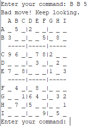
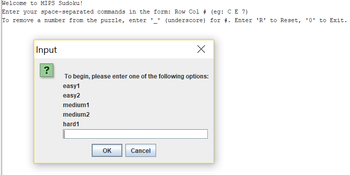

This MIPS program allows users to play sudoku. Given a variety of puzzles of varying difficulties, players can choose which to play. These options are sourced from text files, read through a buffer into the game’s memory, and are formatted properly before being displayed. To run, open project.asm using MARS MIPS Assembler jar file within the same folder as the text files, assemble, and run.

